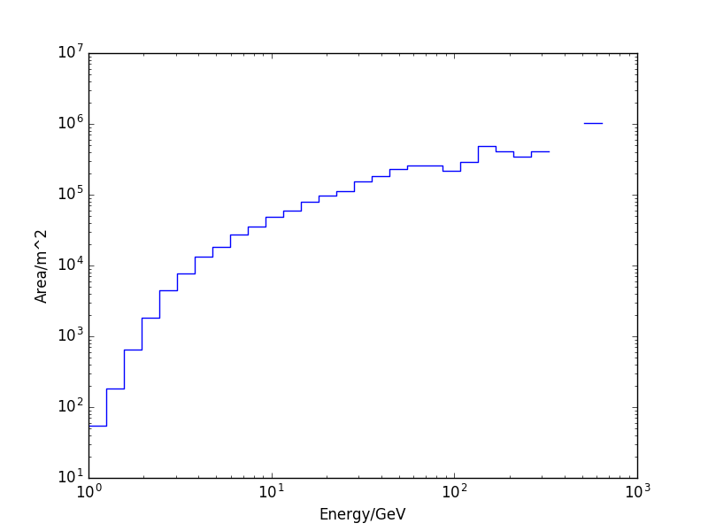

Instrument Response Functions (IRF)
-----------------------------------
for the Atmospheric Cherenkov Plenoscope (ACP)

- Air shower simulations [CORSIKA](https://github.com/TheBigLebowSky/custom_corsika)
- ACP response simulation [mctracer](https://github.com/TheBigLebowSky/mctracer)
- ACP event analysis [plenopy](https://github.com/TheBigLebowSky/plenopy)

Runs with python [scoop](https://github.com/soravux/scoop) for massive parallel deployment over many machines, but also runs on a single machine.

## Install
```bash
pip install git+https://github.com/TheBigLebowSky/instrument_response_function
```

## How to run a simulation
```bash
user@machine:~$ acp_effective_area [-s=SCOOP_HOSTS] -c=CORSIKA_CARD -o=OUTPUT -n=NUMBER_RUNS -a=ACP_DETECTOR -p=MCT_CONFIG -m=MCT_PROPAGATOR
```

## How to explore the results
```python
In [1]: import acp_effective_area as acp_aeff

In [2]: acp_aeff.analysis.export_effective_area(
	input_path='/home/sebastian/Desktop/electron_2016Dec10_01h19m/', 
	detector_responses_key='raw_lixel_sum', 
	detector_response_threshold=100, 
	output_path='/home/sebastian/Desktop/Aeff.csv', 
	bins=31)
```



## What does it do?
When started, an output directory is created ```OUTPUT_PATH``` and all input (corsika steering card, plenoscope scenery, and calibration) is copied into the output path first. Only the copied input is used during the simulation. Next, all the corsika steering cards are created using the template card in ```CORSIKA_CARD```. Only the run number and random seeds are adjusted for each run. Now scoop is used to deploy the simulation jobs onto your cluster ```SCOOP_HOSTS```. A single production job runs the CORSIKA [threadsafe](https://github.com/fact-project/corsika_wrapper) air shower simulation which writes a temporary file of Cherenkov photons. Next the [mctracer](https://github.com/TheBigLebowSky/mctracer) simulates the plensocope responses and also writes them to a temporary file. Next [plenopy](https://github.com/TheBigLebowSky/plenopy) runs an analysis on the temporary plenoscope response and extracts high level information which are stored permanently in the output path. After all simulation jobs are done, the intermediate analysis results by plenopy are condensed in one single ```acp_event_responses.json.gz``` in the output path.
